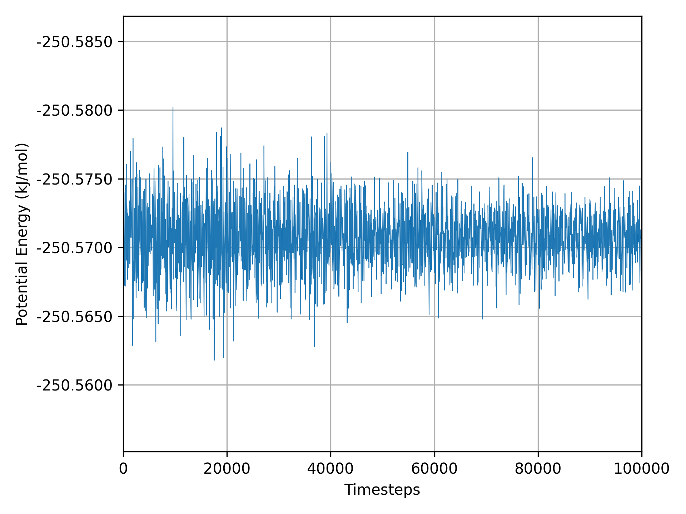
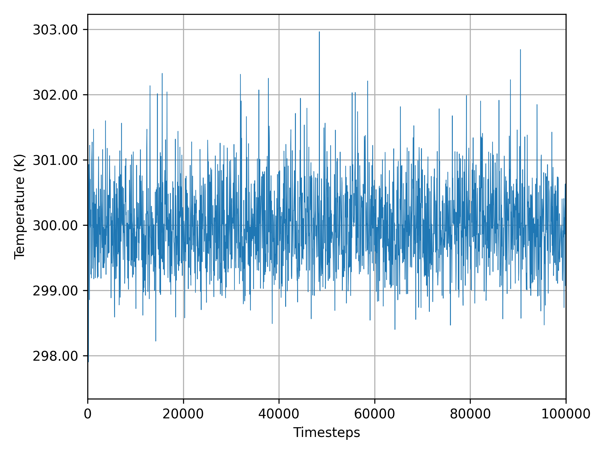

# Examples

[__nve.rs__](./nve.rs) - Simulation of Ar gas in the NVE ensemble. This example uses a Lennard-Jones style pair potential to simulate the pairwise interactions between Ar atoms. The velocity Verlet algorithm is employed to integrate the equations of motion in the system. The total energy of this system is plotted at each timestep in the figure below. Generated with [nve-analyze.py](../scripts/nve-analyze.py).

[__nvt.rs__](./nvt.rs) - Simulation of Ar gas in the NVT ensemble. This example expands upon the NVE example by adding a Nose-Hoover style thermostat to regulate the temperature of the system. The temperature of this system is plotted at each timestep in the figure below. Generated with [nvt-analyze.py](../scripts/nvt-analyze.py).

